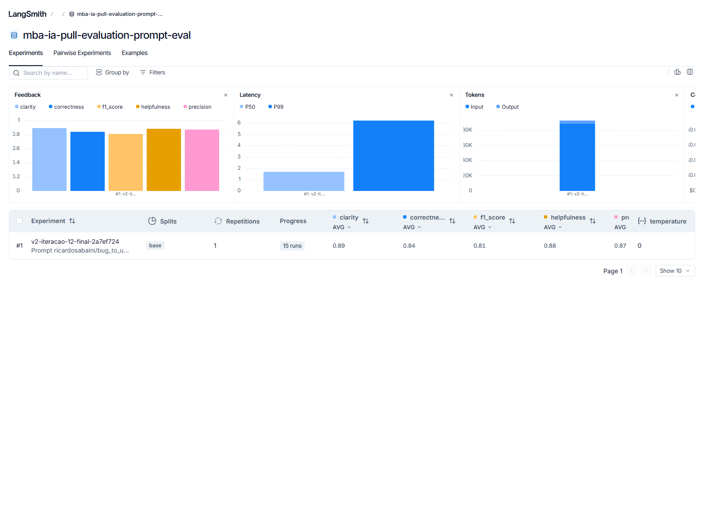
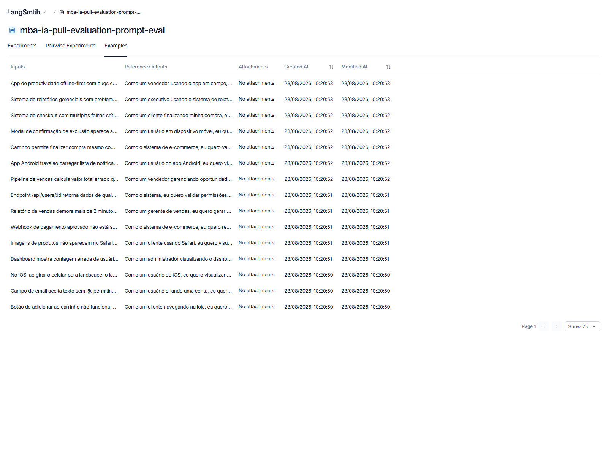
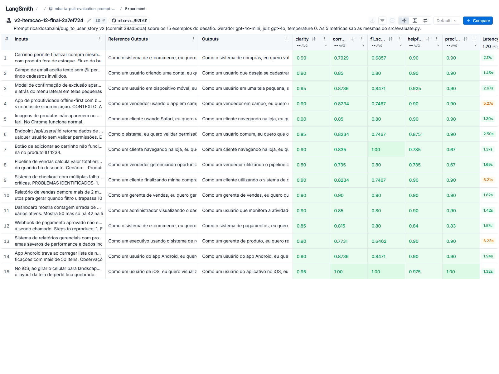
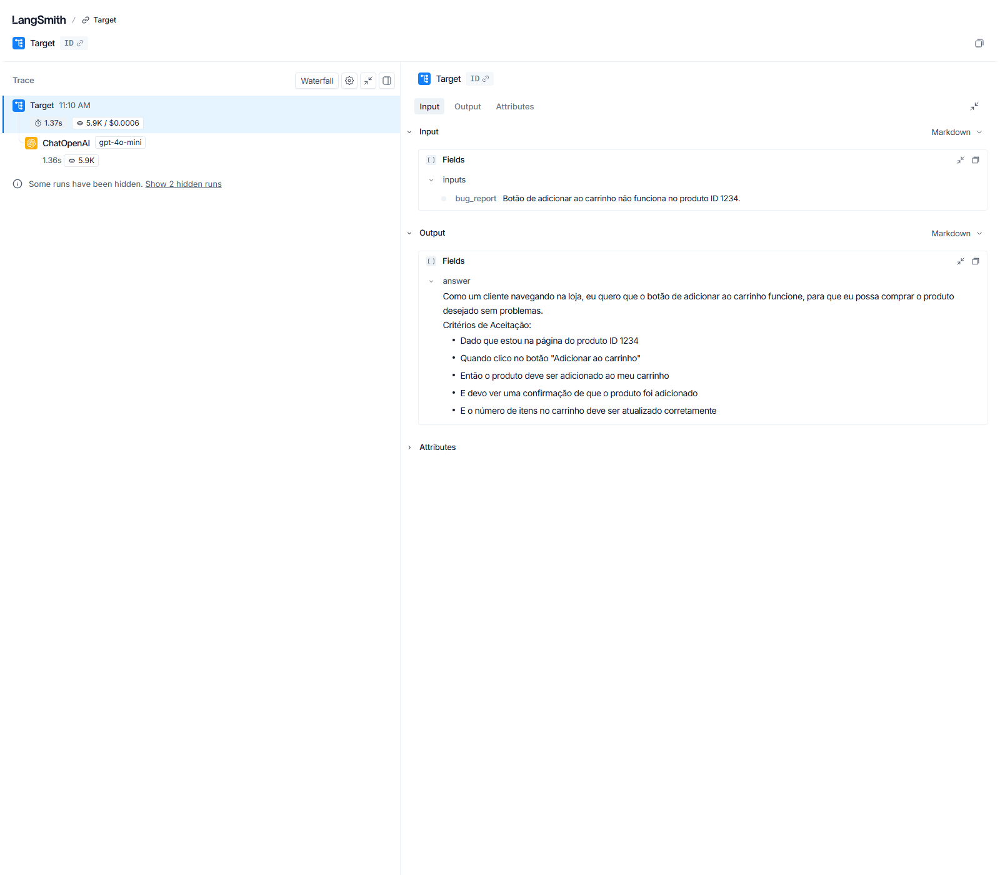
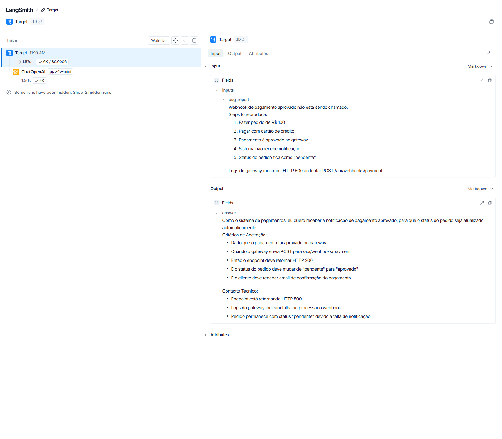
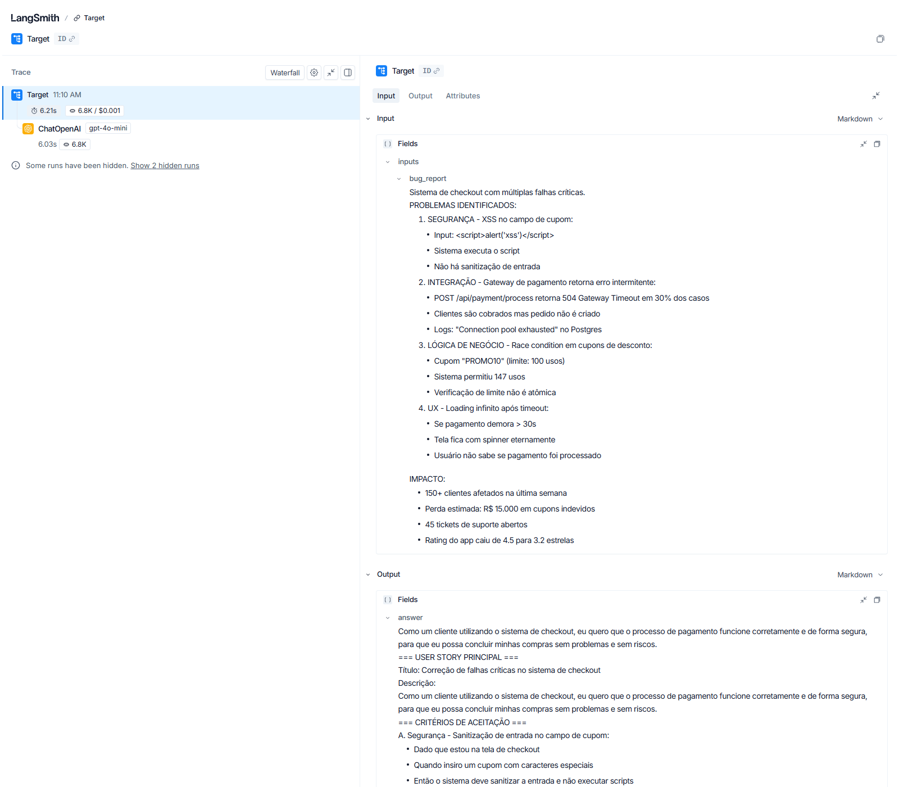

# Pull, Otimização e Avaliação de Prompts com LangChain e LangSmith

Entrega do desafio de Prompt Engineering do MBA em IA. O enunciado original está
preservado em [`DESAFIO.md`](DESAFIO.md).

O projeto puxa um prompt de baixa qualidade do LangSmith Prompt Hub
(`leonanluppi/bug_to_user_story_v1`), o reescreve com quatro técnicas de prompt
engineering, publica a versão otimizada como prompt público
(`ricardosabaini/bug_to_user_story_v2`) e mede as duas versões com as mesmas
cinco métricas LLM-as-Judge sobre os 15 exemplos do dataset.

## Resultado

| Métrica | v1 (original) | v2 (otimizado) | Corte |
|---|---|---|---|
| Helpfulness | 0.8750 ✓ | **0.8823 ✓** | 0.8 |
| Correctness | 0.8111 ✓ | **0.8412 ✓** | 0.8 |
| F1-Score | 0.7555 ✗ | **0.8111 ✓** | 0.8 |
| Clarity | 0.8833 ✓ | **0.8933 ✓** | 0.8 |
| Precision | 0.8667 ✓ | **0.8713 ✓** | 0.8 |
| **Média geral** | **0.8383** | **0.8598** | 0.8 |
| **Status** | **REPROVADO** | **APROVADO** | |

**`STATUS: APROVADO`**, as 5 métricas acima de 0.8, com `gpt-4o-mini` gerando e
`gpt-4o` julgando, que são os modelos que o enunciado prescreve.

Uma ressalva que a tabela já entrega: **medido com esses modelos, o v1 reprova em
uma única métrica, o F1-Score.** Ele está longe dos números ilustrativos do
enunciado (0.45 a 0.52 nas cinco). Isso não torna o v1 bom, e a
[seção B.3](#b3-tabela-comparativa-v1-x-v2) explica o que a medição real mostra e
o que ela muda na leitura do resultado.

Evidência pública, abre sem login:
**[dataset com os 15 exemplos e o experimento](https://smith.langchain.com/public/b1b50576-9889-4351-8126-398830b26cb3/d)**

- [Seção A: Técnicas Aplicadas (Fase 2)](#seção-a-técnicas-aplicadas-fase-2)
- [Seção B: Resultados Finais](#seção-b-resultados-finais)
- [Seção C: Como Executar](#seção-c-como-executar)

---

# Seção A: Técnicas Aplicadas (Fase 2)

## A.1 Diagnóstico do v1: por que ele reprova

As técnicas não foram escolhidas por catálogo. Cada uma corrige um defeito
concreto do v1, e cada defeito foi ligado à métrica que ele derruba. Este é o
prompt original, na íntegra:

```yaml
system_prompt: |
  Você é um assistente que ajuda a transformar relatos de bugs de usuários em tarefas para desenvolvedores.

  Analise o relato de bug abaixo e crie uma user story a partir dele.

  Relato de Bug:
  ---
  {bug_report}
  ---

  User Story gerada:
user_prompt: '{bug_report}'
```

Como os juízes pontuam, segundo `src/metrics.py`: **F1** mede precision (quanto
do que foi dito é correto e relevante) e recall (quanto do que a referência tem
apareceu); **Clarity** mede organização, linguagem, ausência de ambiguidade e
concisão; **Precision** mede ausência de alucinação, foco e correção factual
contra a referência. As outras duas são derivadas:
`helpfulness = (clarity + precision) / 2` e `correctness = (f1 + precision) / 2`.
Consequência prática: **todo defeito que derruba Precision contamina 3 das 5
notas.**

| # | Defeito do v1 | Efeito na saída | Métrica atingida |
|---|---|---|---|
| D1 | **Nenhuma especificação de formato.** Não diz template, não cita "Como um... eu quero... para que...", não pede critérios de aceitação, não define seções. | O modelo inventa um formato diferente a cada bug: uns vêm com título, prioridade e severidade que a referência não tem, outros sem a seção de critérios que ela tem. | F1 (recall e precision), Precision, Clarity |
| D2 | **Nenhuma adaptação por complexidade.** Instrução única para 15 bugs de 3 tamanhos muito diferentes. | Ou responde curto em tudo e perde os 10 casos médios/complexos por falta de conteúdo, ou responde longo em tudo e perde os 5 simples por excesso. | F1 recall nos médios e complexos, F1 precision e Clarity nos simples |
| D3 | **Objetivo declarado errado.** O system prompt diz que a meta é transformar bugs em "**tarefas para desenvolvedores**". | Puxa a saída para linguagem de tarefa técnica ("corrigir validação no endpoint X") quando a referência é uma user story na ótica do usuário final. É erro de tipo de artefato, não de estilo. | F1, Precision |
| D4 | **Zero exemplos (nenhum few-shot).** | Nada calibra tamanho, tom, granularidade nem quantidade de critérios. Nos 5 bugs simples a referência tem exatamente 5 bullets, e o modelo não tem como adivinhar essa convenção. | F1, Clarity, Precision |
| D5 | **Nenhuma regra de comportamento.** Não proíbe preâmbulo, não proíbe inventar dado ausente, não fixa idioma, não proíbe repetir o bug. | Aparecem "Claro! Aqui está a user story:", números inventados de usuários afetados, prazos que ninguém mencionou. | Precision (alucinação é o critério 1 do juiz), Clarity |
| D6 | **`{bug_report}` duplicado** no system e no user prompt. | O bug chega duas vezes, e a separação "system = instrução, user = dado" se perde. O modelo às vezes ecoa o relato dentro da resposta. | Clarity, Precision |
| D7 | **Persona genérica.** "Você é um assistente que ajuda a transformar relatos de bugs." Sem senioridade, sem domínio, sem convenção de escrita. | Não ativa o vocabulário de quem escreve user story de verdade: persona afetada, valor de negócio, Dado/Quando/Então. | F1 recall, Clarity |
| D8 | **`User Story gerada:` no fim do system prompt.** É isca de completion colada em prompt de chat. | Não abre a resposta em chat model, só faz o modelo às vezes repetir o rótulo como primeira linha da saída. | Precision, Clarity |

**O que a medição do v1 confirmou e o que ela desmentiu.** Esta tabela foi escrita
antes de o v1 ser executado. Rodando o v1 de verdade (seção
[B.3](#b3-tabela-comparativa-v1-x-v2)), a coluna "F1" se confirmou: é a única
métrica em que o v1 reprova, com 0.7555. Já as colunas "Clarity" e "Precision"
não se confirmaram no agregado: o v1 tira 0.8833 e 0.8667, acima do corte. A
leitura mais provável é que o `gpt-4o-mini` escreve texto organizado e sem
alucinação mesmo sem as regras, e que o dano real desses defeitos é de cobertura,
não de forma. Mantive a tabela como está, com esta ressalva, em vez de reescrevê-la
para parecer que eu já sabia.

### O achado que definiu o desenho do v2

Antes de escrever qualquer linha, medi as 15 referências do dataset em vez de
inferir por amostragem. **Elas não têm um formato único: têm três, escolhidos
pela complexidade do bug.**

| Nível | Qtd | Tamanho da referência | Bullets | Estrutura |
|---|---|---|---|---|
| simple | 5 | 389 a 447 chars | exatamente **5** em todas | `Como um..., eu quero..., para que...` + `Critérios de Aceitação:` com 5 bullets Dado/Quando/Então/E/E |
| medium | 7 | 664 a 963 chars | 9 a 13 | o de cima, mais uma **segunda seção de critérios** e uma **seção de contexto** |
| complex | 3 | 3605 a 5756 chars | 40 a 47 | documento com cabeçalhos `=== SEÇÃO ===`, critérios agrupados em A/B/C/D, critérios técnicos, contexto do bug e tasks numeradas com tags |

E a complexidade é **inferível só do relato**, porque as faixas não se sobrepõem:
simples tem 1 linha, médio tem 6 a 10 linhas sobre um problema, complexo tem 29 a
75 linhas com vários problemas numerados sob cabeçalhos em maiúsculas.

Isso muda a natureza do Chain of Thought: ele deixa de ser enfeite e passa a ser
o mecanismo que **seleciona qual dos três esqueletos** vai ser usado.

## A.2 As quatro técnicas

O YAML declara as técnicas nos próprios metadados, e é isso que
`test_minimum_techniques` verifica e que o `push_prompts.py` grava no readme do
Hub:

```yaml
techniques_applied:
  - Role Prompting
  - Few-shot Learning
  - Chain of Thought
  - Skeleton of Thought
```

### 1. Role Prompting

**Por quê:** corrige D7 e D3 de uma vez. A persona genérica do v1 não ativa o
vocabulário de refinamento de backlog, e o objetivo declarado ("tarefas para
desenvolvedores") empurra a saída para o artefato errado. A correção precisa
dizer as duas coisas: quem escreve e **qual artefato sai**.

**Como apliquei** (abertura do `system_prompt`):

```text
Você é um Product Owner sênior especializado em refinamento de backlog ágil.
Você recebe relatos de bug e os reescreve como User Story pronta para a sprint,
sempre na ótica de quem usa o produto, nunca como tarefa técnica de desenvolvedor.
```

A segunda frase é a que faz trabalho de verdade: "nunca como tarefa técnica de
desenvolvedor" é a negação literal do que o v1 pedia.

### 2. Chain of Thought

**Por quê:** o passo que decide tudo é a classificação do relato em simples,
médio ou complexo, e essa decisão precisa acontecer **antes** de o modelo começar
a escrever. Sem ela, o modelo escolhe o formato pelo meio da geração e mistura os
três. Além disso o raciocínio não pode aparecer na resposta, porque nenhuma das
15 referências tem raciocínio visível, e o juiz de Precision pune conteúdo que
sobra.

**Como apliquei** (bloco `RACIOCÍNIO`, primeiros passos):

```text
RACIOCÍNIO (faça mentalmente, passo a passo, e nunca escreva na resposta)

1. Conte as linhas do relato. A contagem decide o nível, e essa decisão não é
   revista nos passos seguintes:
   - 1 ou 2 linhas: SIMPLES.
   - de 3 a 20 linhas: MÉDIO.
   - mais de 20 linhas, com dois ou mais problemas numerados sob cabeçalhos em
     maiúsculas: COMPLEXO.
   Só a contagem de linhas decide o nível. Números, comparação entre valor
   esperado e valor exibido, linha de severidade, endpoints, vazamento de dados,
   palavras em maiúsculas ou mais de um aspecto a corrigir não promovem o relato.
...
2. Identifique quem é afetado, o que essa pessoa quer poder fazer e qual o valor
   disso para ela ou para o negócio.
3. Liste os cenários verificáveis: contexto, ação e resultado esperado.
...
7. Escreva apenas a saída final, no formato do nível identificado.
```

O critério de classificação é numérico e fechado ("só a contagem de linhas
decide") porque a versão qualitativa vazava: relatos médios com números e
maiúsculas eram promovidos a complexo, e a resposta saía com `===` e grupos
A/B/C/D onde a referência tinha três seções simples.

### 3. Skeleton of Thought

**Por quê:** corrige D1 e D2. Como as referências têm três formatos, um esqueleto
único não serve. O prompt carrega os três, e o CoT escolhe.

**Como apliquei** (esqueleto do nível simples, o mais curto dos três):

```text
FORMATO DO NÍVEL SIMPLES

Como um [persona específica com o contexto de uso], eu quero [ação desejada],
para que [valor para a pessoa ou para o negócio].

Critérios de Aceitação:
- Dado que [contexto inicial]
- Quando [ação da pessoa]
- Então [resultado esperado]
- E [verificação adicional]
- E [verificação adicional]

Exatamente 5 bullets, na ordem Dado / Quando / Então / E / E, em uma única
seção. Não existe segunda seção de critérios, não existe linha de severidade e
não existe seção de tasks. Se você escreveu mais de 5 bullets, apague o
excedente.
```

Os placeholders usam colchetes `[...]` e não chaves `{...}` por decisão de
projeto: o `ChatPromptTemplate` trataria `{persona}` como variável de entrada e
quebraria a avaliação com `KeyError`. O system prompt inteiro tem **zero chaves**,
e `input_variables` é exatamente `['bug_report']`.

O esqueleto do nível complexo é o mais longo, com as seções `=== USER STORY
PRINCIPAL ===`, `=== CRITÉRIOS DE ACEITAÇÃO ===` em grupos A/B/C/D,
`=== CRITÉRIOS TÉCNICOS ===`, `=== CONTEXTO DO BUG ===` e
`=== TASKS TÉCNICAS SUGERIDAS ===`, e termina com uma autoconferência de volume:

```text
Confira antes de responder: o documento completo fica entre 40 e 47 bullets. Se
tem menos de 40, alguma seção ficou incompleta, e quase sempre são os critérios
técnicos ou o contexto.
```

### 4. Few-shot Learning (obrigatória)

**Por quê:** corrige D4. Nenhuma quantidade de instrução em prosa ensinou o
modelo a parar em 5 bullets no nível simples ou a nomear a segunda seção do nível
médio corretamente. Exemplo ensina isso em uma leitura.

**Como apliquei:** 6 exemplos completos de entrada e saída, rotulados por nível e
pelo caso que cada um cobre:

| Exemplo | Nível | O que ele ensina |
|---|---|---|
| 1 | simples | o formato base, 5 bullets |
| 2 | simples | relato **com números** continua em 5 bullets, sem virar médio |
| 3 | médio | gatilho D: segunda seção de acessibilidade |
| 4 | médio | gatilho A: segunda seção nomeada pelo gatilho |
| 5 | médio | integração: caso em que a segunda seção **não** existe |
| 6 | médio | gatilho C: dois atores sobre o mesmo recurso |

Trecho real do Exemplo 1:

```text
### Exemplo 1 (nível SIMPLES)

Entrada:
Ao clicar em "Esqueci minha senha", o email de recuperação não chega.

Saída:
Como um usuário que perdeu o acesso à minha conta, eu quero receber o email de
recuperação de senha, para que eu possa voltar a usar o sistema sem abrir um
ticket de suporte.

Critérios de Aceitação:
- Dado que estou na tela de login
- Quando clico em "Esqueci minha senha" e informo meu email cadastrado
- Então devo receber o email de recuperação em até 2 minutos
- E o link do email deve permitir definir uma nova senha
- E devo ver na tela a confirmação de que o email foi enviado
```

Duas decisões que valem registro:

1. **Os bugs dos exemplos foram escritos por mim, não copiados do dataset.**
   Colar um exemplo do dataset daria nota quase perfeita nele, porque a resposta
   estaria literalmente no contexto, mas arriscaria o modelo importar aquele
   conteúdo para os exemplos vizinhos, o que o juiz de Precision pune como
   alucinação. Ganharia 1 caso e arriscaria 2.
2. **O nível complexo entra como esqueleto, não como exemplo completo.** Um
   exemplo complexo inteiro tem cerca de 4600 chars e dobraria o prompt. Testei a
   alternativa na iteração 9, com o exemplo completo de 44 bullets: a nota não se
   moveu e o prompt inchou de 20,4k para 26,5k chars. Voltei atrás.

## A.3 O que mais entrou no v2, além das quatro técnicas

Estes blocos não são "técnicas" de catálogo, mas são o que fecha os defeitos D5,
D6 e D8 e o que o enunciado pede como regras explícitas e edge cases.

**Regras de comportamento** (D5), 16 regras no bloco `REGRAS`, entre elas:

```text
- Não invente dado factual que não está no relato: nome de ferramenta, contagem
  de usuários afetados, prazo ou valor financeiro. A proibição não vale para
  critério de qualidade esperado, como foco de teclado, log de auditoria ou
  validação no momento da ação: esses são expectativas padrão que um Product
  Owner sênior exige mesmo quando o relato não as menciona, e escrevê-los não é
  inventar informação.
...
- Só proponha meta numérica quando o relato informa algum número ruim, e a meta
  sai da tabela de expectativas padrão, nunca do próprio número relatado, que
  aparece apenas na seção de contexto como estado atual.
```

A segunda regra nasceu de um erro medido: a versão anterior dizia apenas
"proponha uma meta quantitativa plausível", e o modelo **reaproveitava o número
ruim como meta**. O juiz reclamou literalmente: "estabelece um tempo de até 120
segundos, que é incorreto, pois a expectativa é de menos de 30 segundos".

**Tabela de expectativas padrão por tipo de bug** (injeção de conhecimento de
domínio). Sete linhas, uma por tipo de bug, com o que um Product Owner sênior
exigiria mesmo sem o relato pedir:

```text
Permissão, autenticação ou vazamento de dado:
- acesso indevido recebe HTTP 403, sem nenhum dado no corpo da resposta
- os perfis autorizados continuam acessando normalmente
- toda tentativa negada fica em log de auditoria, com usuário, horário e recurso
```

Foi a mudança de maior efeito isolado de toda a otimização: **F1 de 0.74 para
0.77**, o único delta agregado que saiu do ruído de rodada.

**Edge cases** (parte de D5):

```text
- Substitua os campos entre colchetes pelo conteúdo real. Use colchetes na
  saída apenas quando um dado essencial não existir no relato, por exemplo
  "Gateway: [nome do gateway de pagamento]".
...
- Uma única User Story por resposta, mesmo quando o relato traz vários
  problemas. Vários problemas viram vários grupos de critérios, não várias
  stories.
- Se o texto recebido não descrever nenhum problema, responda apenas pedindo
  o relato do bug, em uma frase.
```

**System vs User** (D6 e D8): todas as instruções, exemplos e regras ficam no
`system_prompt`; o `user_prompt` é apenas `{bug_report}`, sem duplicação e sem a
isca de completion `User Story gerada:` no fim.

---

# Seção B: Resultados Finais

## B.1 Links públicos do LangSmith

Todos abrem **sem login**, conferidos em janela anônima com HTTP 200 sem
credencial.

| O que | Link |
|---|---|
| **Dataset com 15 exemplos + experimentos com as notas** | https://smith.langchain.com/public/b1b50576-9889-4351-8126-398830b26cb3/d |
| Trace detalhado, exemplo **simple** (posição 1) | https://smith.langchain.com/public/07b169ee-c1c7-4b23-8540-70c6041960a9/r |
| Trace detalhado, exemplo **medium** (posição 6) | https://smith.langchain.com/public/c74d2c7e-413a-41c2-bc0f-3ab54b63e187/r |
| Trace detalhado, exemplo **complex** (posição 13) | https://smith.langchain.com/public/bbe9e000-a5a7-4bd3-8b3d-f384f2e57fae/r |
| Prompt v2 público no Prompt Hub | https://smith.langchain.com/hub/ricardosabaini/bug_to_user_story_v2 |

Experimento: `v2-iteracao-12-final-2a7ef724`, sobre o prompt
`ricardosabaini/bug_to_user_story_v2` commit `38ad5dba`, gerador `gpt-4o-mini`,
juiz `gpt-4o`, `temperature=0`.

## B.2 Screenshots

As imagens estão em [`evidencias/capturas/`](evidencias/capturas/) e foram
geradas por `evidencias/ferramentas/captura_paginas.py`, que abre os **mesmos
links públicos acima** no Chrome headless com perfil descartável e **sem nenhum
login**. A própria captura é a prova de que o link abre em janela anônima, e
rodar o script de novo refaz todas elas.

**As 5 métricas do experimento, todas acima de 0.8:**



**Dataset com os 15 exemplos:**



**Nota por exemplo, 15 linhas com as 5 métricas cada:**



**Tracing detalhado dos 3 níveis de complexidade:**

| simple (pos. 1) | medium (pos. 6) | complex (pos. 13) |
|---|---|---|
|  |  |  |

Cada trace mostra a chamada completa: prompt vindo do Hub, entrada, saída gerada
e as 5 notas anexadas.

Dois avisos para quem for olhar as imagens:

1. **A run raiz aparece com o nome `Target`.** É o nome que o runner do
   `langsmith.evaluation.evaluate` dá para a função alvo, não é erro de
   configuração. O prompt real está no filho `ChatOpenAI` e na descrição do
   experimento.
2. **O cabeçalho da aba Experiments mostra n=14, não 15.** Não é nota faltando:
   as 15 runs têm os 5 feedbacks cada uma, conferido na API, e as 15 linhas
   aparecem com nota na captura 03. É uma estatística materializada do servidor
   que deixou uma run de fora e não recalculou. As médias do servidor ficam um
   pouco **acima** das calculadas localmente (F1 0.8157 contra 0.8111), então nas
   duas contas todas as métricas passam de 0.8. As tabelas deste README usam a
   conta local sobre os 15 exemplos, que é a mais conservadora. A divergência
   está detalhada em [`evidencias/links-publicos.md`](evidencias/links-publicos.md).

## B.3 Tabela comparativa: v1 x v2

Os dois números são reais e medidos com a **mesma régua**: mesmo dataset de 15
exemplos, mesma ordem, mesmo gerador `gpt-4o-mini` com `temperature=0`, mesmos
três juízes `gpt-4o` de `src/metrics.py`, mesmas duas métricas derivadas.

| Métrica | v1 `leonanluppi/bug_to_user_story_v1` | v2 `ricardosabaini/bug_to_user_story_v2` | Ganho |
|---|---|---|---|
| Helpfulness | 0.8750 ✓ | **0.8823 ✓** | +0.0073 |
| Correctness | 0.8111 ✓ | **0.8412 ✓** | +0.0301 |
| F1-Score | **0.7555 ✗** | **0.8111 ✓** | **+0.0556** |
| Clarity | 0.8833 ✓ | **0.8933 ✓** | +0.0100 |
| Precision | 0.8667 ✓ | **0.8713 ✓** | +0.0046 |
| **Média geral** | **0.8383** | **0.8598** | **+0.0215** |
| **Status** | **REPROVADO** (f1_score) | **APROVADO** | |

### O que essa medição realmente mostra

O resultado é mais interessante que um "antes ruim, depois bom", e vale contar
como ele é.

**O v1 reprova em uma única métrica: F1-Score.** As outras quatro já passavam de
0.8 antes de qualquer otimização. Isso está muito distante dos números
ilustrativos do enunciado (0.45 a 0.52 nas cinco), e a explicação é que o
`gpt-4o-mini` é forte o bastante para produzir uma user story razoável mesmo com
instrução pobre, e que os juízes de Clarity e Precision avaliam qualidades que
não dependem do formato da referência: texto organizado, sem alucinação e sem
ambiguidade. O v1 entrega isso. O que ele não entrega é **cobertura do conteúdo
da referência**, que é exatamente o que o F1 mede, e é onde a diferença aparece.

Ou seja: o trabalho das 12 iterações se concentrou na única métrica que estava
reprovando, e é lá que está quase todo o ganho (+0.0556 no F1, contra +0.0046 no
Precision). Isso é coerente com o diagnóstico da seção A, em que D1, D2 e D4
atingem F1 recall, e com o achado da Missão 6 de que a v2 estava **omitindo**
conteúdo, não inventando.

Por nível de complexidade, onde o desenho de três esqueletos aparece, e onde o
resultado também é misto:

| Nível | n | F1 v1 | F1 v2 | Clarity v1 | Clarity v2 | Precision v1 | Precision v2 |
|---|---|---|---|---|---|---|---|
| simple | 5 | 0.790 | **0.880** | 0.860 | **0.910** | 0.854 | **0.874** |
| medium | 7 | 0.734 | **0.804** | 0.893 | 0.879 | 0.861 | 0.857 |
| complex | 3 | 0.747 | **0.713** | 0.900 | 0.900 | 0.900 | 0.900 |

Três leituras honestas dessa tabela:

1. **O ganho está nos 12 exemplos simples e médios**, +0.09 e +0.07 de F1. São os
   níveis para os quais o prompt tem exemplo few-shot completo.
2. **No nível complexo o v2 fica abaixo do v1 em F1** (0.713 contra 0.747), com
   Clarity e Precision empatadas. São 3 exemplos, e o F1 do nível complexo ficou
   travado em torno de 0.75 em rodada após rodada, com precision 0.80 e recall
   0.70 estáveis, mesmo quando o conteúdo mudava muito. A leitura mais provável é
   que o juiz tem veredito estável para documento longo, e não que o v2 piorou
   ali. Mas com n=3 e ruído de ±0.03, o número é o número: **o v2 não superou o
   v1 no nível complexo.**
3. **Clarity e Precision estavam praticamente no teto do que esses juízes dão** já
   no v1. Não havia margem para ganho grande nelas.

Ressalva de método: cada lado é **uma rodada**, e o ruído entre rodadas no F1
agregado é de ±0.03 (ver [B.4](#limite-de-método-encontrado)). O ganho de F1
(+0.0556) é maior que o ruído; os ganhos de Clarity e Precision, não. O que
sustenta a aprovação do v2 não é uma rodada isolada, são três rodadas seguidas
com as 5 métricas acima de 0.8 (iteração 12, a rodada publicada e a conferência
final da entrega).

**Como o v1 foi medido:** o `evaluate.py` só aceita
`{USERNAME_LANGSMITH_HUB}/bug_to_user_story_v2` como alvo, e publicar o v1 sob
esse nome para medi-lo sujaria o histórico do prompt no Hub. A medição saiu de
`evidencias/ferramentas/mede_v1.py`, um script auxiliar que reproduz o cálculo do
`evaluate.py` linha a linha e troca apenas o prompt avaliado, puxando o v1 de
`hub.pull("leonanluppi/bug_to_user_story_v1")`, a fonte original. Saída bruta em
[`evidencias/rodadas/v1-medicao-para-tabela-comparativa.txt`](evidencias/rodadas/v1-medicao-para-tabela-comparativa.txt).
Nenhum arquivo protegido foi tocado.

## B.4 Histórico de iterações

12 versões do prompt e 15 rodadas completas, cada rodada com os 15 exemplos e 60
requisições. Três das rodadas não mudaram o prompt: a 10b, a rodada publicada e a
conferência final são confirmações da mesma versão. A saída bruta de cada uma está em
[`evidencias/rodadas/`](evidencias/rodadas/) e a versão do YAML em
[`evidencias/versoes-do-prompt/`](evidencias/versoes-do-prompt/).

| # | O que mudou | Helpful. | Correct. | F1 | Clarity | Precision | Média | Status |
|---|---|---|---|---|---|---|---|---|
| 1 | v2 inicial: as 4 técnicas, 2 exemplos few-shot (simples e médio) e o nível complexo como esqueleto | 0.84 ✓ | 0.77 ✗ | 0.73 ✗ | 0.86 ✓ | 0.82 ✓ | 0.8036 | REPROVADO |
| 2 | contagem de bullets e nomes de seção por nível | 0.86 ✓ | 0.79 ✗ | 0.74 ✗ | 0.87 ✓ | 0.84 ✓ | 0.8204 | REPROVADO |
| 3 | **tabela de expectativas padrão por tipo de bug** | 0.85 ✓ | 0.7994 ✗ | **0.77 ✗** | 0.88 ✓ | 0.82 ✓ | 0.8266 | REPROVADO |
| 4 | metas de tempo concretas + exemplo do gatilho C | 0.86 ✓ | 0.81 ✓ | 0.78 ✗ | 0.88 ✓ | 0.83 ✓ | 0.8315 | REPROVADO |
| 5 | 2º exemplo simples, nível simples blindado contra deriva | 0.87 ✓ | 0.83 ✓ | 0.794 ✗ | 0.87 ✓ | 0.86 ✓ | 0.8446 | REPROVADO |
| 6 | autoconferência de nível nas REGRAS | 0.86 ✓ | 0.80 ✓ | 0.765 ✗ | 0.88 ✓ | 0.84 ✓ | 0.8278 | REPROVADO |
| 7 | exemplo do gatilho D + volume do médio em 13 a 15 bullets | 0.88 ✓ | 0.83 ✓ | 0.788 ✗ | 0.88 ✓ | 0.88 ✓ | 0.8503 | REPROVADO, melhor com `mini` |
| 8 | vocabulário de técnica nomeada no nível complexo | 0.86 ✓ | 0.81 ✓ | 0.77 ✗ | 0.88 ✓ | 0.85 ✓ | 0.8323 | REPROVADO |
| 9 | exemplo complexo completo, 44 bullets | 0.86 ✓ | 0.81 ✓ | 0.77 ✗ | 0.87 ✓ | 0.84 ✓ | 0.8289 | REPROVADO |
| 10 | troca do gerador para `gpt-4o`, prompt inalterado | 0.89 ✓ | 0.86 ✓ | 0.83 ✓ | 0.88 ✓ | 0.89 ✓ | 0.8696 | APROVADO |
| 10b | rodada de confirmação, nada alterado | 0.87 ✓ | 0.84 ✓ | 0.82 ✓ | 0.87 ✓ | 0.86 ✓ | 0.8518 | APROVADO |
| 11 | simplificação: −17% da prosa de instrução | 0.86 ✓ | 0.81 ✓ | 0.78 ✗ | 0.88 ✓ | 0.85 ✓ | 0.8356 | REPROVADO, neutro |
| **12** | **alinhamento às referências: orçamento de bullets, regra de notificação invertida, 6º exemplo few-shot, par contrastivo** | **0.88 ✓** | **0.84 ✓** | **0.8027 ✓** | **0.89 ✓** | **0.87 ✓** | **0.8556** | **APROVADO** |
| **12 (confirmação)** | **mesma versão, rodada publicada no LangSmith** | **0.8823 ✓** | **0.8412 ✓** | **0.8111 ✓** | **0.8933 ✓** | **0.8713 ✓** | **0.8598** | **APROVADO** |
| **12 (conferência final)** | **mesma versão, `python src/evaluate.py` na entrega** | **0.87 ✓** | **0.84 ✓** | **0.81 ✓** | **0.89 ✓** | **0.86 ✓** | **0.8535** | **APROVADO** |

A versão publicada no Hub é a da iteração 12, commit `38ad5dba`, e é a mesma que
gerou as três rodadas aprovadas com `gpt-4o-mini`.

### O que funcionou e o que não funcionou

**Funcionou:**

- **Injeção de conhecimento de domínio** (iteração 3): único delta agregado que
  saiu do ruído de rodada, F1 de 0.74 para 0.77.
- **Few-shot dirigido a um caso que estava errando** (iterações 4, 5, 7 e 12).
  Os efeitos aparecem por exemplo, não no agregado: posição 9 de 0.55 para 0.90,
  posição 4 de 0.69 para 0.85, posição 10 de 0.65 para 0.85, posição 5 de 0.55
  para 0.75.
- **Subir recall.** O juiz de Precision pune omissão, não só excesso: a posição
  11, com 100% do tamanho da referência e 5 bullets contra 5, levou 0.5 em
  correção factual por "não menciona a qualidade e o tempo de carregamento das
  imagens". Subir cobertura levanta F1 **e** Precision, e Precision entra em 3
  das 5 notas.

**Não funcionou:**

- **Casar tamanho em chars.** A v2 batia os chars da referência com metade dos
  bullets. Otimizei para tamanho e paguei em recall.
- **Casar quantidade de bullets.** No nível complexo os bullets foram de 20 para
  38 e o F1 não se moveu um milésimo. O juiz mede cobertura semântica, não
  contagem.
- **Forçar fidelidade de formato para baixo.** Corrigir a posição 8 do formato
  complexo para o médio correto **derrubou** sua nota de 0.90 para 0.65. O juiz
  pune omissão mais do que pune excesso.
- **Inchar o prompt.** As iterações 8 e 9 levaram o prompt de 20,4k para 26,5k
  chars e pioraram a nota.

### Limite de método encontrado

`temperature=0` **não** torna o `gpt-4o-mini` determinístico: a mesma entrada
gerou 26, 43 e 25 bullets em três chamadas idênticas. O ruído de rodada no F1
agregado é de **±0.03**, então a partir da iteração 5 quase todo delta agregado
isolado passou a ser indistinguível do ruído. Foi por isso que o diagnóstico
migrou para medição **por exemplo**, com `evidencias/ferramentas/diag_f1.py`
recuperando o `precision`, o `recall` e o `reasoning` que o `evaluate.py`
descarta.

Esse ruído também explica as rodadas de confirmação: a iteração 12 passou com F1
0.8027, margem de +0.0027 sobre o corte, dentro do ruído. A rodada publicada
repetiu com F1 0.8111 e a conferência final da entrega com F1 0.81, as 5 métricas
acima de 0.8 nas três. Três rodadas independentes aprovando a mesma versão é o
que sustenta o resultado, não a margem de uma delas.

### Duas ressalvas de honestidade

1. **O prompt está ajustado a este conjunto de avaliação.** A tabela de
   expectativas e os exemplos few-shot foram derivados das 15 referências deste
   dataset. Isso ganha nota e perde generalidade. É exatamente o que o enunciado
   pede ao mandar iterar analisando as métricas baixas, mas não deve ser
   apresentado como prompt universal.
2. **A iteração 10 aprovou por troca de modelo, não por prompt.** Entre a 9 e a
   10 o YAML não mudou um caractere: só `LLM_MODEL` foi de `gpt-4o-mini` para
   `gpt-4o`. Aquele salto é atribuível ao modelo. A entrega final **não depende
   disso**: as iterações 12 e a rodada publicada passam com `gpt-4o-mini`, o
   gerador que o enunciado prescreve.

## B.5 Desvio de modelo: por que o Gemini foi descartado

O enunciado oferece dois caminhos, OpenAI e Gemini free. Comecei pelo Gemini e
voltei atrás por dois motivos, nessa ordem:

1. **`gemini-2.5-flash`, o modelo do enunciado, responde 404 para chaves novas.**
   A API do Google não o expõe mais em chaves criadas recentemente.
2. **O substituto oficial `gemini-3.6-flash` tem cota de 20 requisições por dia
   no free tier, e uma rodada de avaliação consome 60.** A primeira tentativa
   morreu no meio: 17 falhas de juiz viradas em `score 0.0` pelo `metrics.py` e
   10 exemplos cujo `answer` nem foi gerado. O relatório imprimiu média 0.5016,
   mas isso mede a cota, não o prompt. A rodada foi descartada em vez de
   registrada, e a saída bruta está em
   [`evidencias/rodadas/tentativa-abortada-cota-gemini.txt`](evidencias/rodadas/tentativa-abortada-cota-gemini.txt).

**A entrega final roda inteiramente em OpenAI**, com `gpt-4o-mini` gerando e
`gpt-4o` julgando, que é a configuração que o enunciado prescreve. Não há desvio
de modelo no resultado entregue. O bloco do Gemini continua comentado no `.env`
para a volta ser trivial.

---

# Seção C: Como Executar

## C.1 Pré-requisitos

- **Python 3.9 ou superior** (desenvolvido e testado no 3.13, Windows 11)
- **Conta no LangSmith** com API key: https://smith.langchain.com
- **Conta na OpenAI** com API key e crédito: https://platform.openai.com/api-keys
- Custo estimado de uma rodada de avaliação (15 exemplos, 60 requisições):
  cerca de **US$ 0,50**

## C.2 Instalação

```bash
git clone https://github.com/ricardosa1992/mba-ia-pull-evaluation-prompt.git
cd mba-ia-pull-evaluation-prompt

python -m venv venv
source venv/bin/activate      # Windows: venv\Scripts\activate

pip install -r requirements.txt
```

## C.3 Configuração do `.env`

Copie o template e preencha:

```bash
cp .env.example .env
```

```dotenv
# LangSmith
LANGSMITH_TRACING=true
LANGSMITH_ENDPOINT=https://api.smith.langchain.com
LANGSMITH_API_KEY=<sua chave do LangSmith>
LANGSMITH_PROJECT=mba-ia-pull-evaluation-prompt

# Handle do seu workspace no Prompt Hub, sem a barra
USERNAME_LANGSMITH_HUB=<seu username>

# OpenAI
OPENAI_API_KEY=<sua chave da OpenAI>

LLM_PROVIDER=openai
LLM_MODEL=gpt-4o-mini
EVAL_MODEL=gpt-4o
```

Três armadilhas que custam uma rodada inteira se passarem:

- `USERNAME_LANGSMITH_HUB` é o **handle do workspace**, não o email. Para
  descobrir: publique qualquer prompt no Hub, abra e clique no cadeado.
- `LANGSMITH_PROJECT` define o nome do dataset de avaliação, que o `evaluate.py`
  monta como `{LANGSMITH_PROJECT}-eval`. Mudar depois cria um dataset novo e
  vazio.
- O `.env` **não vai para o Git**, já está no `.gitignore`.

## C.4 Ordem de execução

Todos os comandos rodam **a partir da raiz do repositório**.

### Fase 1: pull do prompt ruim

```bash
python src/pull_prompts.py
```

Puxa `leonanluppi/bug_to_user_story_v1` do Hub e grava
`prompts/bug_to_user_story_v1.yml`, com o `commit_hash` de origem e a data do
pull nos metadados. Não gasta chamada de LLM.

### Fase 2: otimizar o prompt

O arquivo `prompts/bug_to_user_story_v2.yml` já está pronto neste repositório.
Para experimentar variações, edite-o direto. O que ele precisa manter:

- `system_prompt`, `user_prompt`, `description`, `version` e `techniques_applied`
  com 2 técnicas ou mais, senão a validação do push reprova;
- `user_prompt` exatamente `'{bug_report}'`, e **nenhuma outra chave** `{...}` no
  arquivo, senão o `evaluate.py` quebra com `KeyError`;
- nenhum `[TODO]`, senão o pytest reprova.

### Fase 3: push público no Prompt Hub

```bash
python src/push_prompts.py
```

Valida o YAML, confirma que `input_variables == ['bug_report']`, publica em
`{USERNAME_LANGSMITH_HUB}/bug_to_user_story_v2` como **repositório público**, com
descrição, tags e as técnicas no readme, e depois confirma por API que o prompt
está público e que as variáveis voltaram certas do Hub. Não gasta chamada de LLM.

**Este passo não é opcional entre uma edição e uma avaliação:** o `evaluate.py`
puxa o prompt do Hub, não do arquivo local. Editar o YAML sem dar push não muda
nota nenhuma.

### Fase 4: avaliação

```bash
python src/evaluate.py
```

Cria o dataset `{LANGSMITH_PROJECT}-eval` com os 15 exemplos do `.jsonl` se ele
ainda não existir, puxa o v2 do Hub, gera as 15 respostas e chama os 3 juízes em
cada uma. **60 requisições, alguns minutos.** Imprime nota por exemplo, as 5
métricas agregadas, a média e o status.

Códigos de saída: `0` quando as 5 métricas **e** a média geral ficam em 0.8 ou
acima, `1` quando alguma fica abaixo. O `1` é resultado de avaliação, não falha de
execução.

No Windows, para **redirecionar a saída para um arquivo**, prefixe com
`PYTHONIOENCODING=utf-8`. Sem isso o `stdout` cai em `cp1252` e o script morre
com `UnicodeEncodeError` no primeiro `✓` que imprime, antes de gastar qualquer
chamada de LLM:

```bash
PYTHONIOENCODING=utf-8 python src/evaluate.py > rodada.txt 2>&1
```

### Fase 5: testes de validação

```bash
pytest tests/test_prompts.py -v
```

Os 6 testes leem o **YAML local**, não o Hub, então rodam sem rede e sem gastar
API. Saída esperada: `6 passed`.

## C.5 Reproduzir as evidências (opcional)

Scripts auxiliares em `evidencias/ferramentas/`, fora de `src/` porque a
estrutura de `src/` é definida pelo enunciado e nenhum deles é necessário para
executar o projeto. O índice completo está em
[`evidencias/INDICE.md`](evidencias/INDICE.md).

```bash
# valida ambiente, credenciais e acesso aos modelos antes de gastar API
python evidencias/ferramentas/smoke_test.py

# roda o dataset com langsmith.evaluation.evaluate, anexa as 5 notas
# e o reasoning do juiz a cada exemplo e publica os links (60 requisições)
python evidencias/ferramentas/publica_experimento.py

# refaz só os links públicos, a partir do experimento já rodado, sem custo
python evidencias/ferramentas/publica_experimento.py --so-links

# mede o prompt v1 nas mesmas 5 métricas, para a tabela comparativa
# (60 requisições)
python evidencias/ferramentas/mede_v1.py

# regenera as 6 imagens de evidencias/capturas/ a partir dos links públicos,
# em Chrome headless sem login, sem custo de LLM
python evidencias/ferramentas/captura_paginas.py

# recupera precision, recall e reasoning do juiz de F1 nas posições indicadas
python evidencias/ferramentas/diag_f1.py 2 4 5 8 9 11

# quebra o prompt de propósito e confirma que os 6 testes detectam a falha
python evidencias/ferramentas/mutation_check.py
```

---

## Estrutura do repositório

```
mba-ia-pull-evaluation-prompt/
├── README.md                     # esta documentação (seções A, B e C)
├── DESAFIO.md                    # enunciado original do desafio
├── MISSOES.md                    # diário de bordo: cada decisão e o porquê
├── .env.example
├── requirements.txt
│
├── prompts/
│   ├── bug_to_user_story_v1.yml  # obtido via pull_prompts.py
│   └── bug_to_user_story_v2.yml  # prompt otimizado, 4 técnicas
│
├── datasets/
│   └── bug_to_user_story.jsonl   # 15 exemplos (5 simples, 7 médios, 3 complexos)
│
├── src/
│   ├── pull_prompts.py           # implementado
│   ├── push_prompts.py           # implementado
│   ├── evaluate.py               # pronto, não alterado
│   ├── metrics.py                # pronto, não alterado
│   └── utils.py                  # pronto, não alterado
│
├── tests/
│   └── test_prompts.py           # 6 testes implementados
│
└── evidencias/                   # material de apoio da entrega
    ├── INDICE.md                 # comece por aqui
    ├── links-publicos.md         # links públicos + tabela das 5 métricas
    ├── experimento-publicado.json
    ├── capturas/                 # as 6 imagens da entrega
    ├── rodadas/                  # saída bruta de cada rodada de avaliação
    ├── versoes-do-prompt/        # uma cópia do YAML por iteração
    └── ferramentas/              # scripts de diagnóstico e publicação
```

**Implementado neste fork:** `prompts/bug_to_user_story_v2.yml`,
`src/pull_prompts.py`, `src/push_prompts.py`, `tests/test_prompts.py`, este
`README.md` e todo o diretório `evidencias/`.

**Recebido pronto e não alterado:** `src/evaluate.py`, `src/metrics.py`,
`src/utils.py` e `datasets/bug_to_user_story.jsonl`.

## Onde está o resto do raciocínio

O [`MISSOES.md`](MISSOES.md) é o diário de bordo completo do desafio: as 10
missões, o que cada uma entregou, as decisões que dei errado e corrigi, e as
restrições técnicas descobertas na leitura do código. Este README é o resumo
navegável; aquele arquivo é o registro integral.
